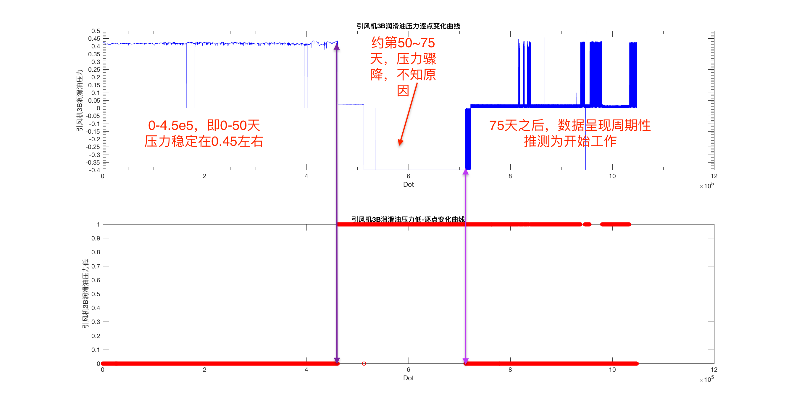

# 引风机3B润滑油压力，引风机3B润滑油压力低

M列数据内容为「引风机3B润滑油压力」，N列数据内容为「引风机3B润滑油压力低」。

根据之前分析的结果推测N列数据为M列数据的报警信号，目前希望从工厂方得知出发低压报警的具体数值以便于我们分析异常。

从两列数据的对比图可以暂且看出在紫线的位置压力突然降低，触发报警信号（传感器数值变为 1 ），之后报警信号一直未撤销，在第二条竖直紫线部分开始出现剧烈波动，报警信号在 0~1 之间剧烈波动。

我们抽离出这部分数据进一步分析。

目前这幅图像比较令人疑惑的地方在于，虽然两列数据都呈现出来了周期性，但是在升压过程中低压报警器发出了 1 报警。

之后的波折周期过程大致也呈现如图，我们根据上图中上方图像得知润滑油压力变化为一个周期过程，但不知道报警信号为何会在较低压处不报警，较高压处反而报警，我们推测其报警机制不完全和压力的数值相关。

综上所述，整体

大致润滑油周期过程如下。

这点与之前推测的其他装置的周期基本一致。

