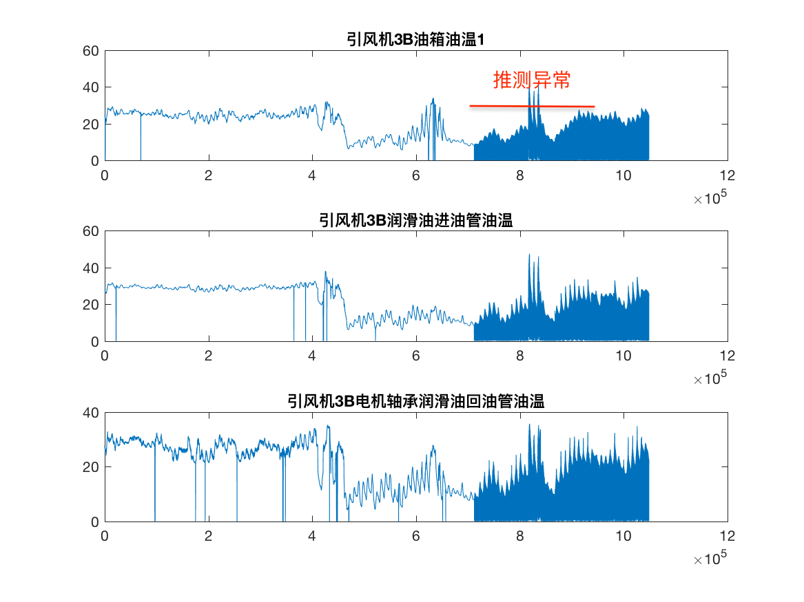
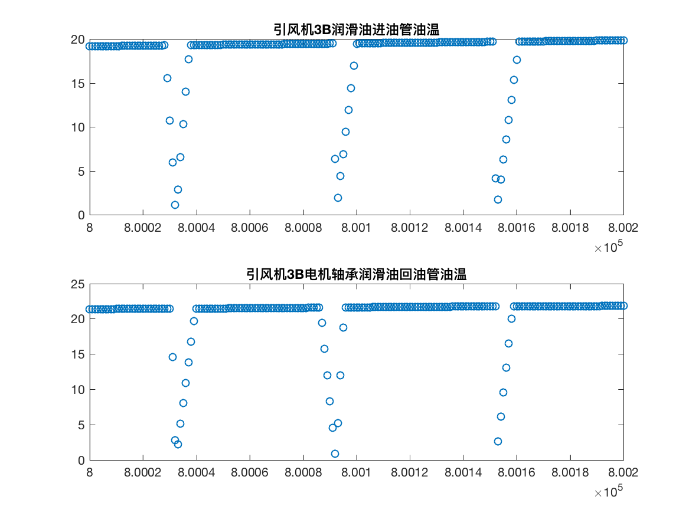

Q：引风机3B油箱油温1
R：引风机3B润滑油进油管油温
S：引风机3B电机轴承润滑油回油管油温 

**数据分析**

图像上大体呈现出三个阶段，和之前的各列数据反映出的情况类似，即如下图。

在这里我们不清楚油箱与润滑油是否有关联，所以我们单独分析后两列数据的关联性，推测其具有滞后性，即如下图。

进一步分析具体的数据

从数据上，两者变化规律一致，但是图像并不存在明显的滞后关系，因此我们推论其为周期性的滞后，即为回油管油温变化趋势，向前推一个或多个周期，能完全契合进油管油温曲线。

但是此处存在疑问就是，从开始工作处我们并不能看出两者存在滞后的关系，因此我们可能还需要**更多的了解这个设备的工作原理**才能结合数据进一步的分析。

