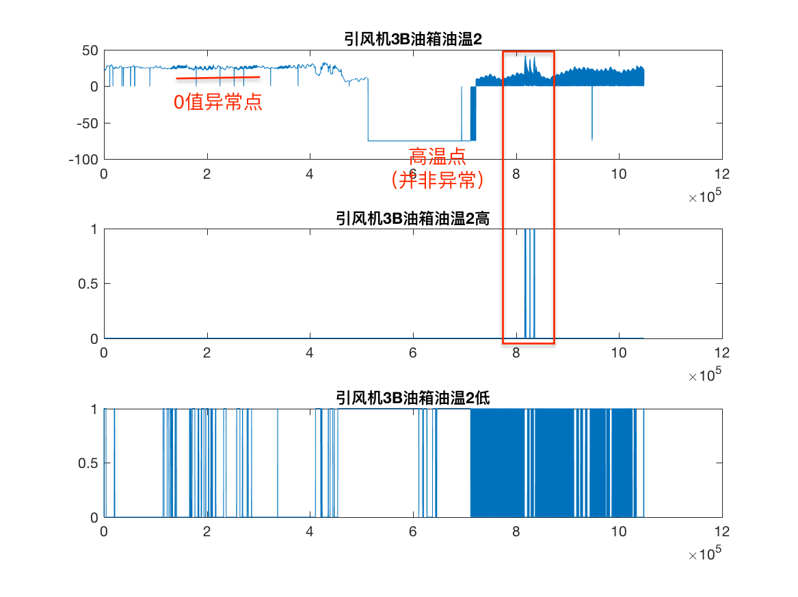
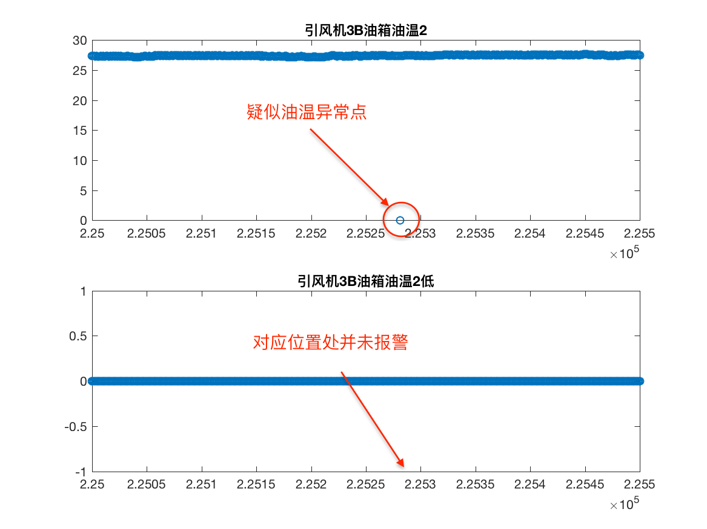
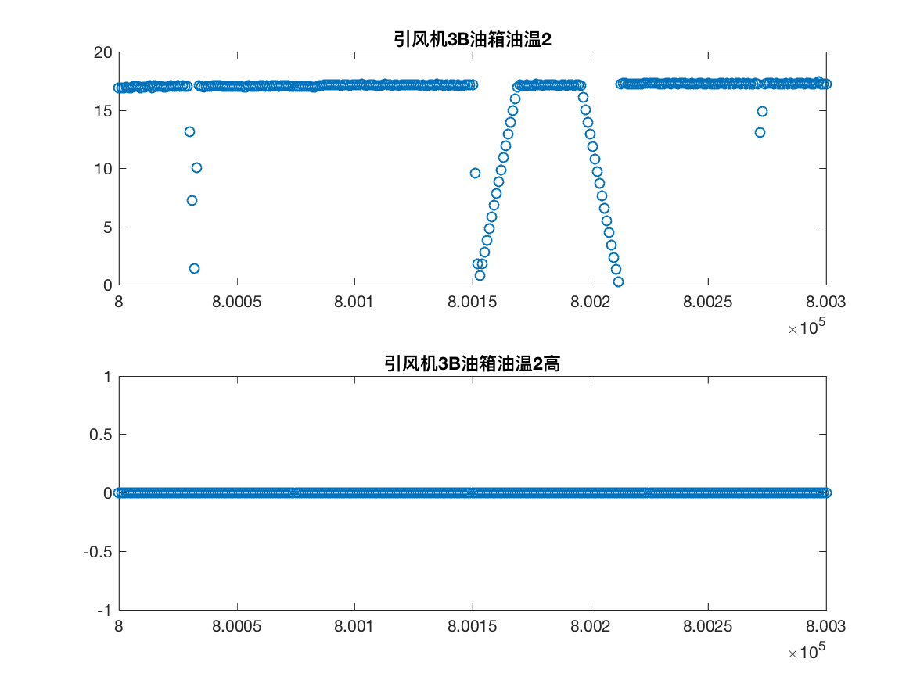
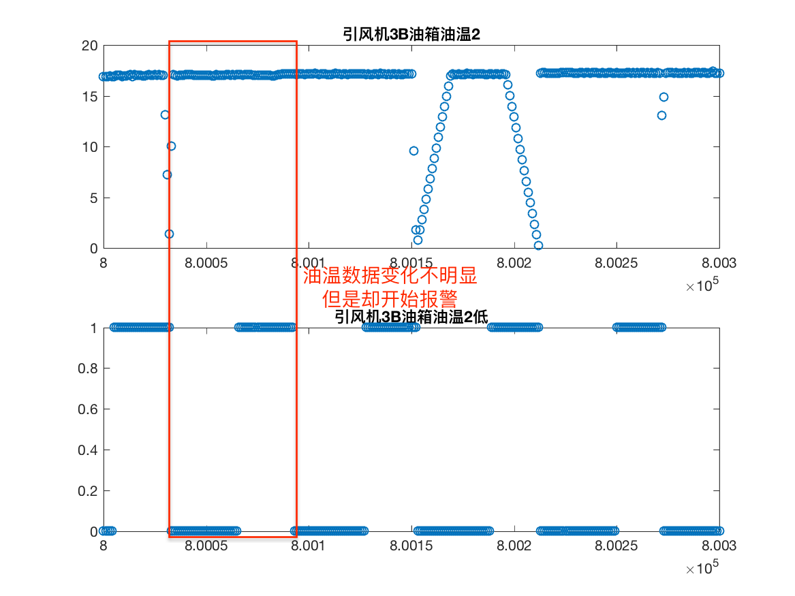
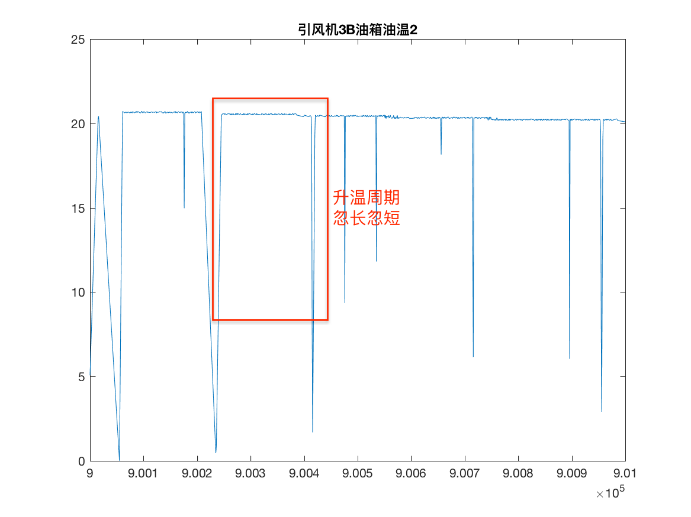

T：引风机3B油箱油温2

U：引风机3B油箱油温2高

V：引风机3B油箱油温2低

**数据分析**

整体数据范围如图，同样我们推测数据2，3为数据 1 的报警信号，**这里我们对数据3频繁出现报警信息感到疑问**。

我们对零值异常点对应横坐标处的低温报警信号进行了查询。

其中疑似油温异常点处并未报警，这让我们感到有些疑惑。

接下来我们对高温处进行更细致的观察。

低温报警信号似乎有一些问题。

通过观察数据，疑似存在周期性，其实通过前面所有的数据观察，我们已经可以显然的发现，此机器工作周期为500s，然后会停机100s，但是此油箱的数据并未严格的呈现出周期性，因此我们希望获得此油箱：「引风机3B油箱油温2」的更详细信息。

